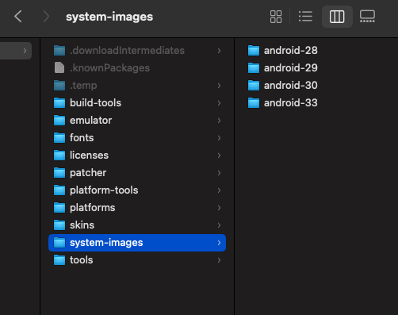

#指令列表

---
###步驟

```
cd ~/Library/Android/sdk/platform-tools/
```
在**開啟模擬器之後**輸入
```
./adb shell
```
確認運行
```
id
```
退出
```
exit
```
---
回到SDK
```
cd ..
```
下載rootAVD
```
git clone https://github.com/newbit1/rootAVD.git
```
宣告路徑
```
export PATH=~/Library/Android/sdk/platform-tools:$PATH
```
移步到rootAVD資料夾內，輸入以下指令後模擬器會自動重開，重開後即完成刷機
```
./rootAVD.sh ~/Library/Android/sdk/system-images/android-31/google_apis_playstore/x86_64/ramdisk.img
```

---
###附錄：如何移除已經被Root過的手機？


打開以下資料夾
```
~/Library/Android/sdk/system-images
```
###
找到你已經Root過的相對應版本，並刪除



重啟Android studio後重新安裝即可